# ARTMV: A Cross-Modal Art Music Video Dataset for Proprioceptive Valence Perception
We present a novel approach for affective multimedia content analysis to study how the human keypoints contribute to the perceived emotion of art music. Traditional music information retrieval methodologies have extensively used the cross-modal bias of audio and visual modalities to assess perceived affective states. However, in the case of art music videos, the visual modality is limited by the static nature of images or an orchestra compared to the rich visualizations in other music genres' videos. We introduce ARTMV: the art music video database consisting of perceived static categorical valence labels, corresponding audio pieces and related dance videos. To overcome the restrictive visual content, our proposed network competitively trades the visual modality of the videos for the proprioception of the performers from the dance of the corresponding art music. 

### Word Histograms per Video 

The word histograms of the survey study are shown:

| 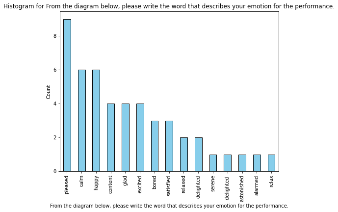 | 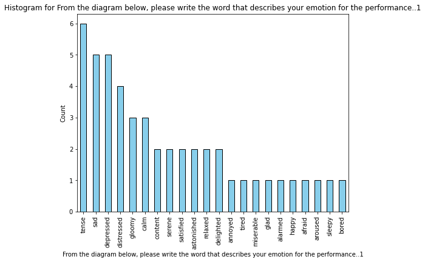 | 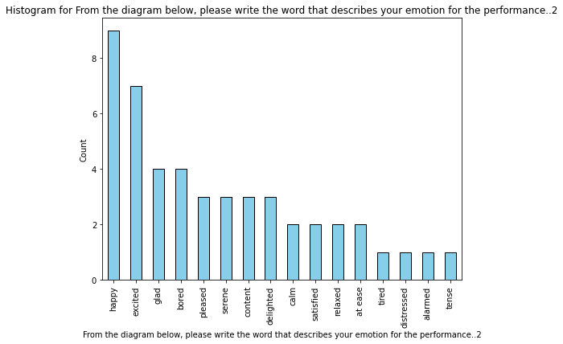 | 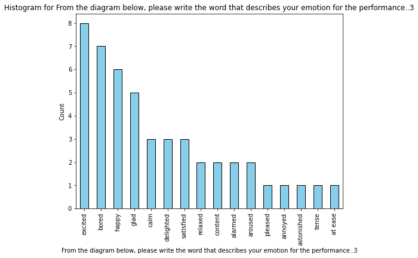 |
|---|---|---|---|
| 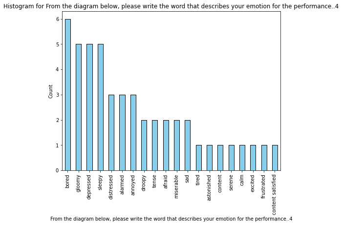 | 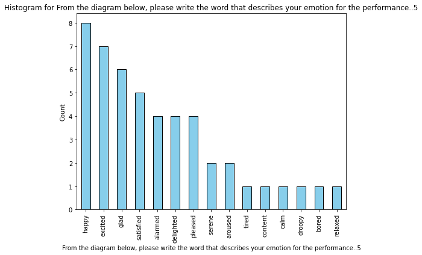 | 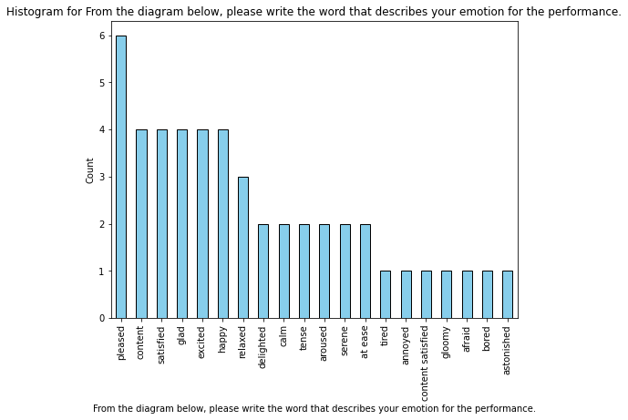 | 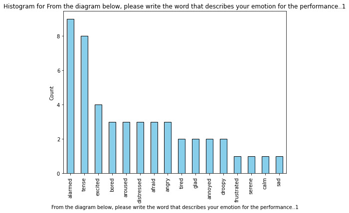 |
| 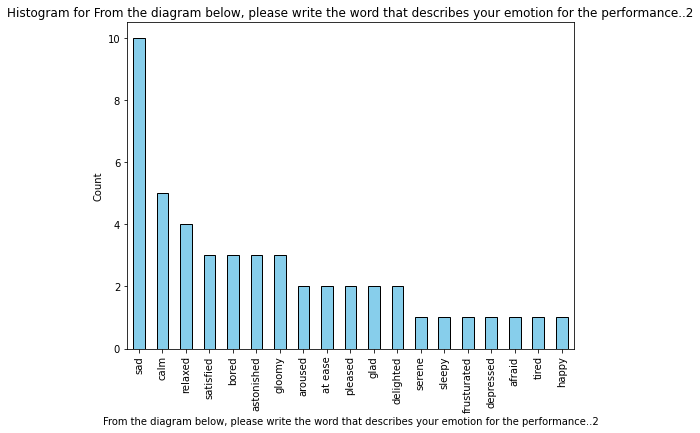 | 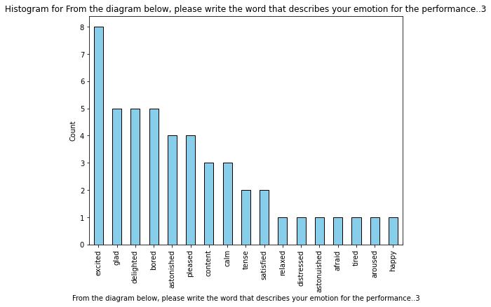| 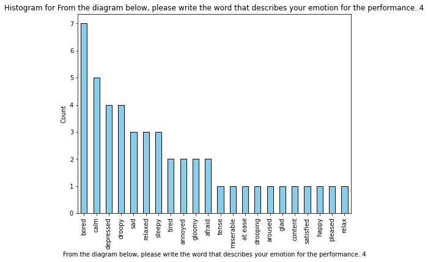| 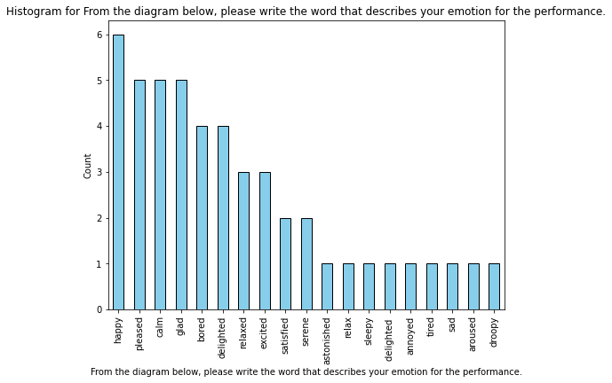 |
| 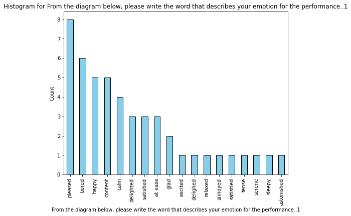 | 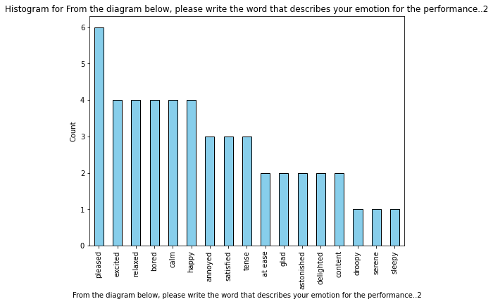 | 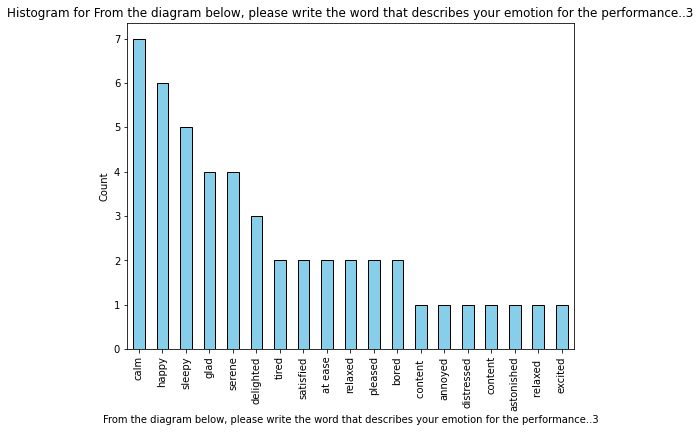 | 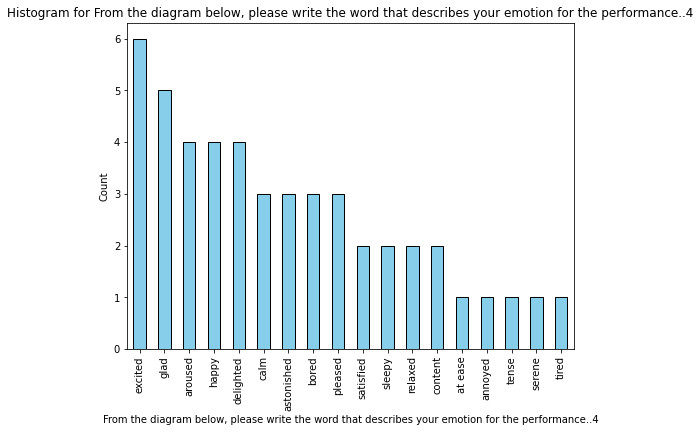 |

### Video Frame Length vs Valence

Audio valence levels from Spotify API and frame lengths for art videos in the dataset are shown. Low and high valence annotations are represented as class 0
and 1, respectively.

